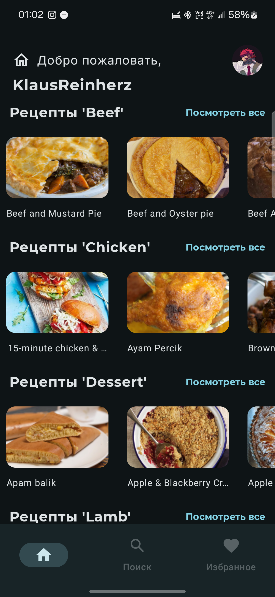
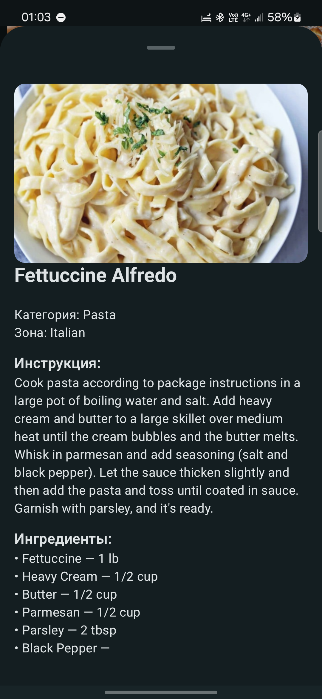
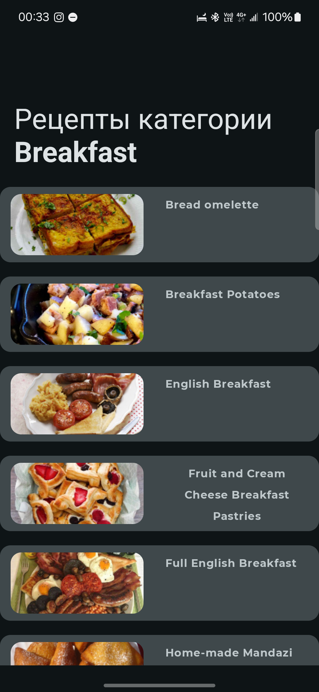

<h1 align="left">Simple recipe app based on themealdb API</h1>
<h3 align="left">This project was created to refresh the knowledge of Jetpack Compose and practice using the main development stack.</h3>

### Screenshots:
| | | |
|:---:|:---:|:---:|
| MainScreen | MealDetails | CategoryList |

## TODO(Global):
* ~~Full category meal lists~~
* Search
* ~~Favorites (store in Firebase)~~

## Stack:
* Jetpack Compose
* Material Design
* MVVM
* Flow
* Room(TBA)
* Retrofit
* Hilt
* Firebase(auth, database)
* Coil
